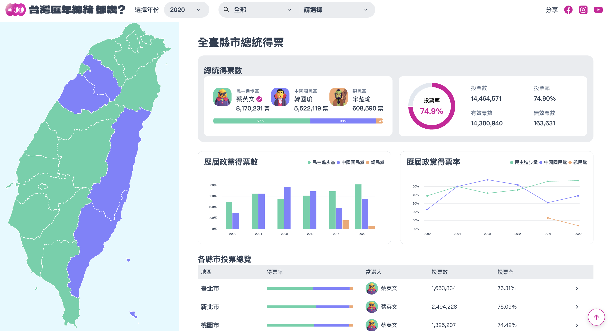

# The F2E 2023 - Mission 2 總統即時開票全台地圖 



網站連結 [連結](https://jasonhts0817.github.io/the-f2e-2023-president/)

F2E 2023 官網 [連結](https://2023.thef2e.com/news)

# 作品說明

## UI 設計作品

The F2E 2023 - Mission 2 總統即時開票全台地圖

台灣歷年總統 都幾？

- 作者：jhen
- 連結：https://2023.thef2e.com/users/12061579704041679194?week=2

# 系統說明

專案安裝

```
npm i
```

專案啟動

```
npm start
```

專案打包

```
npm run build:prod
```

# Node.js 版本

v 16.16.0

# 使用技術

- Angular
  - Stanealone
  - Material cdk
  - Reactive Form
- CSS
  - TailwindCSS
  - RWD
- 其他
  - D3.js
  - Web Worker
  - Indexed DB (dexie)
  - TopoJSON

# 資料夾說明

```

├── data                                        // 原始資料
│   ├── map
│   └── president
├── script                                      // 資料轉換腳本
│   ├── map-data-transform.ts
│   └── vote-data-transform.ts
├── src
│   ├── api                                    // API 資料
│   │   ├── map                                // Topo Json 地圖檔
│   │   │   ├── 1982
│   │   │   ├── 2012
│   │   │   └── 2016
│   │   │       ├── counties.json
│   │   │       └── towns
│   │   └── president                          // 歷屆選舉資料
│   │       ├── 1996
│   │       ├── 2000
│   │       ├── 2004
│   │       ├── 2008
│   │       ├── 2012
│   │       ├── 2016
│   │       └── 2020
│   │           ├── elbase.json                 // 行政區基本資料檔
│   │           ├── elcand.json                 // 候選人資料檔
│   │           ├── elctks.json                 // 候選人得票檔
│   │           ├── elpaty.json                 // 政黨基本資料檔
│   │           └── elprof.json                 // 選舉概況檔
│   ├── app
│   │   ├── app-routing.module.ts
│   │   ├── app.component.ts
│   │   ├── app.module.ts
│   │   ├── app.worker.ts                       // Web Worker
│   │   ├── core                                // 共用的 Angular 元件、Typescript 物件
│   │   │   ├── enums
│   │   │   │   ├── deputy.enum.ts
│   │   │   │   ├── elected-mark.enum.ts
│   │   │   │   ├── gender.enum.ts
│   │   │   │   └── vote-year.enum.ts
│   │   │   ├── models
│   │   │   │   ├── elbase.model.ts
│   │   │   │   ├── elcand.model.ts
│   │   │   │   ├── elctks.model.ts
│   │   │   │   ├── elpaty.model.ts
│   │   │   │   ├── elprof.model.ts
│   │   │   │   └── map.model.ts
│   │   │   └── service
│   │   │       ├── api.service.ts
│   │   │       └── db.service.ts
│   │   ├── layout                              // 外層layout
│   │   │   ├── footer
│   │   │   │   ├── footer.component.html
│   │   │   │   └── footer.component.ts
│   │   │   ├── header
│   │   │   │   ├── header.component.html
│   │   │   │   └── header.component.ts
│   │   │   └── layout
│   │   │       ├── layout.component.html
│   │   │       └── layout.component.ts
│   │   ├── pages                               // 頁面
│   │   │   ├── landing-page                    // 首頁
│   │   │   │   ├── landing-page.component.html
│   │   │   │   └── landing-page.component.ts
│   │   │   └── vote-map                        // 投票地圖
│   │   │       ├── vote-map.component.html
│   │   │       ├── vote-map.component.ts
│   │   │       ├── vote-map.service.ts
│   │   │       └── vote-map.view-model.ts
│   │   └── shared                              // 共用的樣式元件
│   │       ├── charts                          // 圖表
│   │       │   ├── bar-chart.component.ts
│   │       │   ├── donut-chart.component.ts
│   │       │   ├── line-chart.component.ts
│   │       │   ├── map-chart.component.ts
│   │       │   └── stack-chart.component.ts
│   │       └── drop-down                       // 下拉選單
│   │           ├── drop-down-option.component.ts
│   │           └── drop-down.component.ts
│   ├── assets
│   │   ├── icons                               // icon
│   │   ├── images                              // 圖片
│   │   ├── logo-text.png
│   │   └── logo.png
│   ├── styles
│   │   ├── _base.scss                          // 預設樣式
│   │   ├── _field.scss                         // 表單樣式
│   │   └── _font.scss                          // 字體樣式
│   ├── environments                            // 環境變數
│   ├── favicon.ico
│   ├── index.html
│   ├── main.ts
│   ├── styles.scss
│   └── 404.html
├── tailwind.config.js                          // Tailwind 設定檔
├── angular.json
├── package.json
├── tsconfig.app.json
├── tsconfig.dtl.json
├── tsconfig.json
├── tsconfig.spec.json
└── tsconfig.worker.json
```
